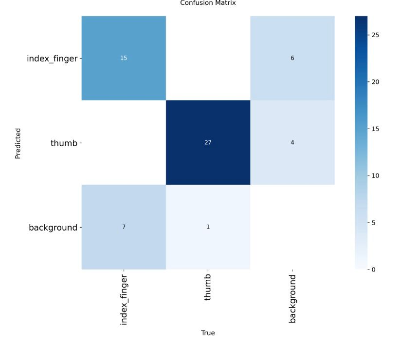
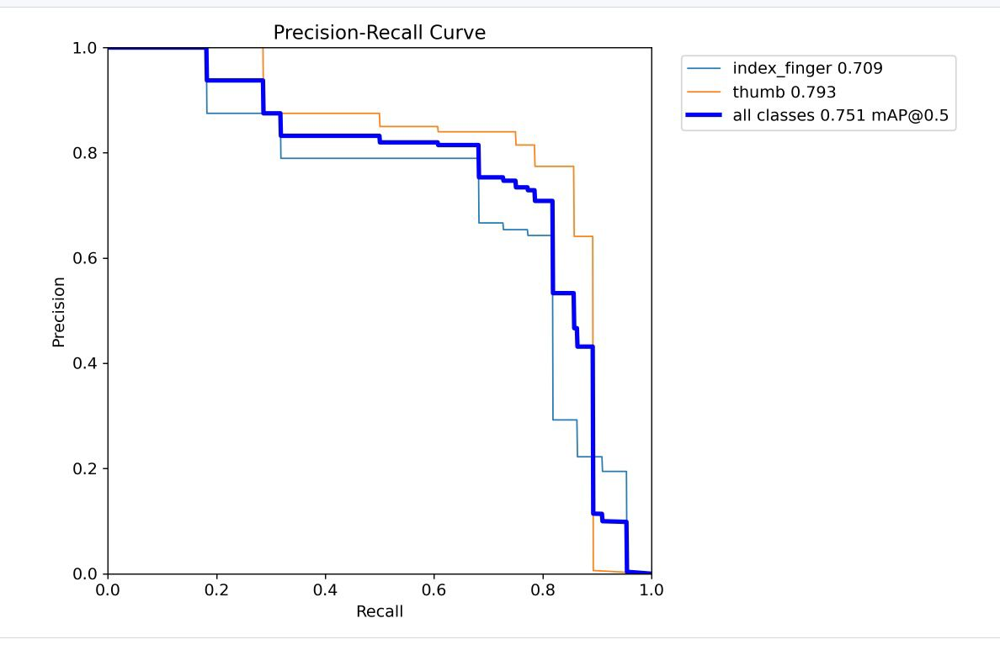
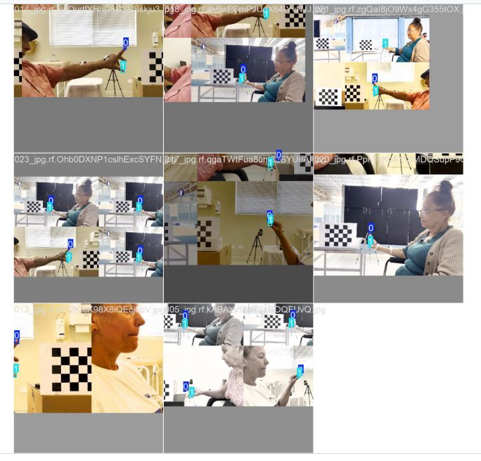
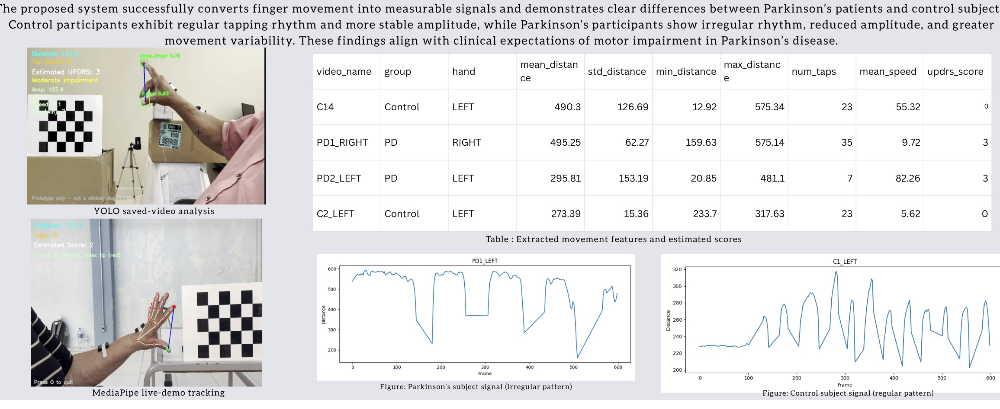
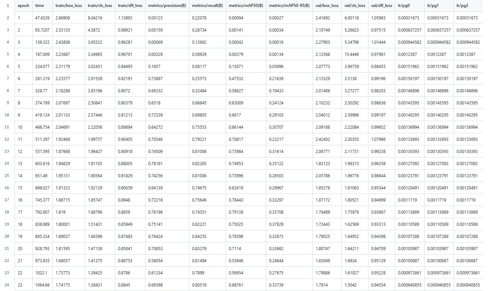

# AI-Based Parkinson’s Disease Movement Analysis

## Overview
This project focuses on analysing Parkinson’s Disease movement patterns using artificial intelligence and computer vision techniques. The system uses hand and body movement analysis to study motion behaviour associated with Parkinson’s symptoms.

This project was completed as part of a collaborative university AI project.

---

## Technologies Used
- Python
- OpenCV
- MediaPipe
- YOLOv5
- Machine Learning
- Jupyter Notebook

---

## Features
- Hand landmark detection
- Pose estimation
- Coordinate extraction
- Motion tracking
- Feature analysis
- Real-time movement visualisation

---

## Project Workflow
1. Video/Image Input
2. Hand & Pose Detection
3. Landmark Coordinate Extraction
4. Feature Processing
5. Movement Pattern Analysis
6. Output Visualisation

---

## My Contribution
- Research and project documentation
- AI workflow analysis
- Feature extraction discussion
- Presentation and exhibition preparation
- Testing and evaluation support

---

## Future Improvements
- Improve dataset size and diversity
- Add deep learning classification models
- Improve real-time prediction accuracy
- Develop a user-friendly interface

---

## Academic Project
This repository represents a university group project focused on applying AI and computer vision concepts to healthcare-related challenges.

## Project Results

### Confusion Matrix  

### Precision Recall Curve

### Patient Detection Samples

### MediaPipe Tracking

### Signal Analysis Table

### Training Results

